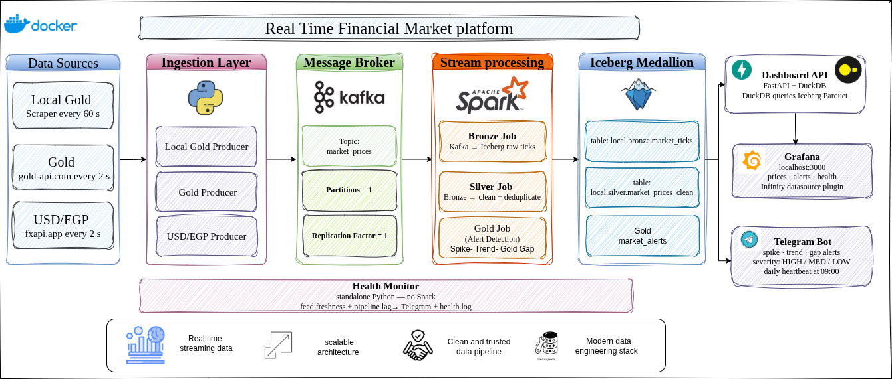

# Financial Market Platform

A real-time market data pipeline that ingests live gold and currency prices, detects anomalies (spikes, trends, and arbitrage gaps), and surfaces them through Telegram alerts and a Grafana dashboard.

Built with **Kafka**, **Apache Spark Structured Streaming**, and **Apache Iceberg** — with a lightweight, Spark-free monitoring and dashboard layer on top.



---

## What it does

Three producers continuously fetch prices and publish them to Kafka:

| Symbol | Source | Interval |
|---|---|---|
| `USD/EGP` | fxapi.app | 2s |
| `XAU/USD` (global gold) | gold-api.com | 2s |
| `XAU/EGP_LOCAL` (21k local gold) | gold-price-live.com (scrape) | 60s |

A medallion-architecture Spark pipeline (Bronze → Silver → Gold) cleans the data and runs three kinds of detection on it:

| Alert | Trigger |
|---|---|
| `SPIKE_UP` / `SPIKE_DOWN` | Price moves ≥ `SPIKE_THRESHOLD`% in a single tick |
| `UPTREND` / `DOWNTREND` | Last `TREND_COUNT` ticks all move the same direction |
| `GOLD_GAP` | Local 21k gold price diverges ≥ `GAP_THRESHOLD` EGP from the price implied by global gold × USD/EGP |

Alerts are written to an Iceberg table and pushed to Telegram. A standalone health monitor watches feed freshness and pipeline lag independently of Spark, and a Grafana dashboard visualizes everything.

---

## Architecture

```
Producers (Python)
    └── Kafka topic: market_prices
            ├── Bronze job   → local.bronze.market_ticks        (raw ticks)
            ├── Silver job   → local.silver.market_prices_clean (cleaned, deduped)
            └── Alert job    → local.gold.market_alerts         (spike/trend/gap alerts)
                                 ├── Telegram notifications
                                 └── local.gold.alert_engine_state (cooldowns, survives restarts)

Dashboard API (FastAPI + DuckDB, no Spark)
    └── reads the same Iceberg/Parquet files directly
            └── Grafana dashboard

Health monitor (standalone, no Spark)
    └── reads the same Parquet files
            └── Telegram alerts on stale feeds or pipeline lag
```

The dashboard API and health monitor deliberately **don't use Spark** — they read the Iceberg warehouse's Parquet files directly via DuckDB. This keeps them lightweight (no JVM, <200MB images) and avoids a second source of truth.

---

## Quickstart

### Prerequisites
- Docker + Docker Compose
- Python 3.12
- Java 11+ (for Spark)

### 1. Start infrastructure (Kafka, Postgres, Dashboard API, Grafana)

```bash
docker compose up -d
```

Grafana will be available at **http://localhost:3000** (`admin` / `admin`), with the datasource and dashboard pre-provisioned.

### 2. Install Python dependencies

```bash
python -m venv venv
source venv/bin/activate   # or venv\Scripts\activate on Windows
pip install -r requirements.txt
```

### 3. Configure environment

```bash
cp .env.example .env
# Edit .env — at minimum set TELEGRAM_BOT_TOKEN and TELEGRAM_CHAT_ID
```

### 4. Start the producers

```bash
python -m producer.main
```

### 5. Start the Spark jobs (each in its own terminal)

```bash
./run_spark.sh bronze
./run_spark.sh silver
./run_spark.sh alerts
```

### 6. Start the health monitor (optional, standalone)

```bash
python -m spark_streaming.health.monitor
```

---

## Configuration

All configuration lives in `.env` — see `.env.example` for the full list with defaults and explanations. Key groups:

- **Kafka / Iceberg** — broker address, topic name, warehouse path
- **Spike / trend thresholds** — `SPIKE_THRESHOLD`, `TREND_COUNT`, `ALERT_COOLDOWN`
- **Gold gap thresholds** — `GAP_THRESHOLD`, `MIN_GAP_CHANGE`, `GAP_COOLDOWN`, severity bands
- **Staleness guards** — `STALE_PRICE_SECONDS`, `LOCAL_PRICE_MAX_AGE_SECONDS` (prevents false gap alerts from lagging feeds)
- **Health monitor** — per-symbol silence thresholds, max pipeline lag
- **Telegram** — bot token and chat ID

---

## Project structure

```
financial-market-platform/
├── producer/                  # Kafka producers
│   ├── main.py
│   ├── producers/              # usdegp, gold (global), gold (local scraper)
│   ├── services/                # API clients, scraper, outlier validator
│   └── utils/                   # Kafka producer config
├── shared/                     # Schemas + logger (single source of truth)
├── spark_streaming/
│   ├── alerts/                  # Alert engine, gap detector, Iceberg-backed state store
│   ├── bronze/                  # Raw ingest: Kafka → Iceberg
│   ├── silver/                  # Cleaning + deduplication
│   ├── gold/                    # Alert inspection scripts
│   ├── health/                  # Standalone health monitor (DuckDB, no Spark)
│   ├── notifications/           # Telegram sender
│   ├── common/                  # SparkSession factory, schema re-exports
│   ├── config/                  # settings.py — every env var, in one place
│   └── entrypoint.py             # CLI entry point for Spark jobs
├── dashboard_api/              # FastAPI + DuckDB service for Grafana (no Spark)
│   ├── main.py
│   ├── reader.py
│   └── grafana_provisioning/    # Auto-provisioned datasource + dashboard
├── tests/                       # Unit tests — no Spark required to run
├── warehouse/                   # Iceberg table storage (gitignored, regenerated)
├── checkpoints/                 # Spark streaming checkpoints (gitignored)
├── docker-compose.yml
└── requirements.txt
```

---

## Running tests

```bash
pytest tests/ -v
```

Tests cover the pure logic (spike/trend detection, gap detection, price validation) using stubbed state stores — no Spark or Kafka needed to run them.

---

## Design notes

**Why state is persisted to Iceberg, not kept in memory.** The alert engine and gap detector need to remember the last price per symbol and recent alert timestamps (for cooldowns). Keeping that in memory means every restart loses context and can immediately re-fire alerts. `AlertStateStore` persists this to a small Iceberg table via `MERGE`, so a restart picks up exactly where it left off.

**Why GOLD_GAP has separate thresholds from SPIKE/TREND.** Early versions used one severity scale for everything, which misclassified gap alerts (a 100 EGP gap and a 100 EGP price spike are not equally significant). Gap severity now uses its own EGP-based bands (`GAP_SEVERITY_HIGH`, `GAP_SEVERITY_MEDIUM`) and a much longer cooldown, since the gap can drift slowly without representing a new event.

**Why there are staleness guards on both legs of the gap calculation.** The global gold price updates every 2s; the local scraped price updates every 60s. If global gold moves fast while local hasn't caught up yet, the computed "gap" is just lag, not a real arbitrage signal. Both `STALE_PRICE_SECONDS` (global) and `LOCAL_PRICE_MAX_AGE_SECONDS` (local) independently suppress the alert when either input is too old to trust.

**Why the dashboard API and health monitor don't use Spark.** Both only need to *read* the warehouse, not process streams. DuckDB reading Parquet directly is dramatically lighter (no JVM startup, no Maven/Ivy resolution, <200MB container) and avoids keeping a second copy of the data in sync.

---

## Known limitations / future work

- `producer/producers/stocks_producers.py` — not yet implemented (see TODO in file)
- `spark_streaming/silver/transformations.py` (windowed moving averages) — written but not wired into any job yet; planned for a future Silver+ aggregation layer
- The local gold scraper depends on a third-party site's HTML structure and will break if that page changes

---

## License

MIT — see [LICENSE](./LICENSE) for details.
